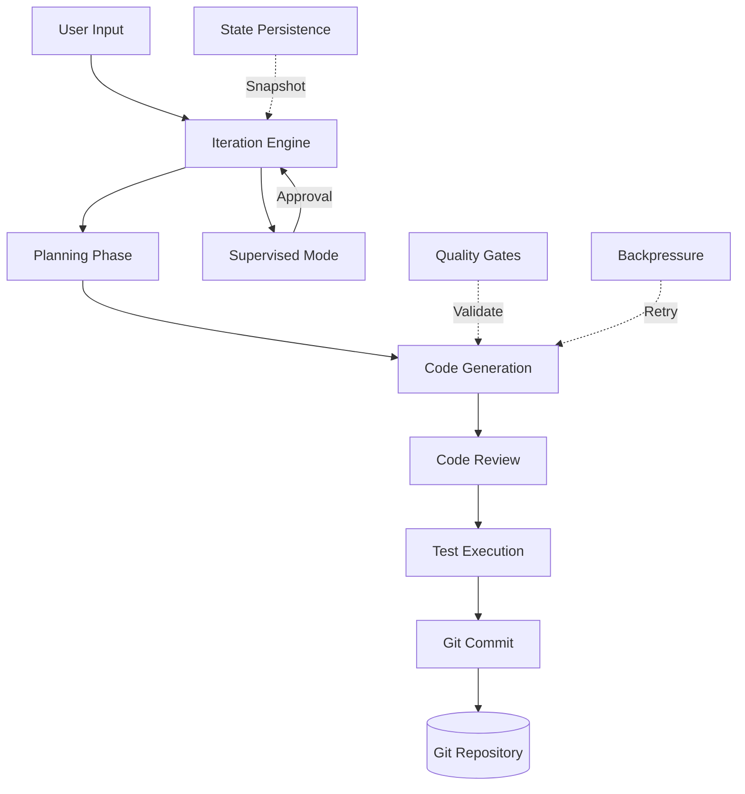

# Modules: Core Overview

## Header & Navigation
- [Module Catalog](../README.md)
- [API Reference](../../api/cli.md)
- [Testing Guide](../../testing/overview.md)

## 1. Module Introduction

### 1.1 Brief Description
The AUTOPILOT Core module implements the autonomous iteration pipeline that transforms AI coding sessions from stateless conversations into structured, persistent, and supervised implementation workflows. It orchestrates the full Plan → Code → Review → Test → Commit lifecycle with quality enforcement and state recovery.

### 1.2 Position & Role
AUTOPILOT Core is the central runtime module that coordinates all plugin subsystems. It sits between the opencode plugin API layer and the Git/SCM infrastructure. The Iteration Engine drives the FSM, while supporting subsystems (State Persistence, Quality Gates, Backpressure, Supervised Mode) provide cross-cutting capabilities. Core is the only module with direct knowledge of the full pipeline; all other features plug into it.

## 2. Feature List

| Feature Name | Description | Link |
|---|---|---|
| Architecture | System components, module layout, provider abstraction | [architecture.md](architecture.md) |
| Iteration Loop | Plan → Code → Review → Test → Commit FSM | [iteration-loop.md](iteration-loop.md) |
| State Persistence | Disk-based session snapshots with integrity checks | [state-persistence.md](state-persistence.md) |
| Supervised Mode | User approval gates at critical pipeline steps | [supervised-mode.md](supervised-mode.md) |
| Quality Gates | Automated lint and test execution after code generation | [quality-gates.md](quality-gates.md) |
| Backpressure | Exponential backoff and retry for API rate limits | [backpressure.md](backpressure.md) |

## 3. High-Level Architecture

## 4. Global Dependencies

| Dependency | Type | Role |
|---|---|---|
| opencode | Plugin API | Lifecycle hooks, CLI registration, output rendering |
| git | SCM | Code commits, diff generation, repository context |
| Node.js | Runtime | JavaScript/TypeScript execution environment |
| file system | State | Session persistence, configuration storage |

## 5. Skill Reference

| Output | Generating Skill |
|---|---|
| Architecture specification | System Architecture Design |
| Iteration loop feature doc | Feature Implementation |
| State persistence design | Domain Modeling, Database Documentation |
| Supervised mode spec | Error Handling Patterns, Security Review |
| Quality gates specification | CI/CD Pipeline Scripting, Testing Pipeline |
| Backpressure handler design | Performance Optimization, API Implementation |
