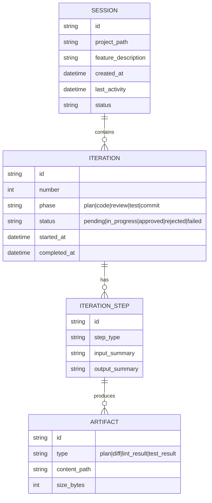
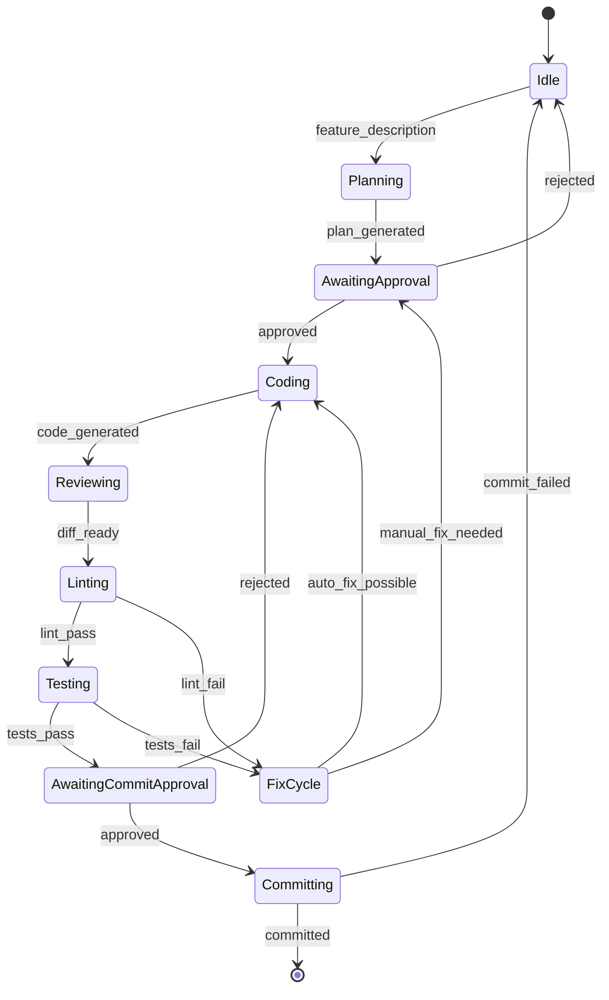

# Technical Design Brief: AUTOPILOT Core Loop

## Actors & Roles

| Actor | Role | Scope |
|---|---|---|
| Developer (User) | Initiates features, approves/rejects iteration steps, reviews output | In |
| AUTOPILOT Agent | Executes iteration loop (plan → code → review → test → commit) | In |
| AI Model Provider (Claude/GPT-4) | Generates code and analysis on request | In |
| opencode Host Process | Manages session lifecycle, provides plugin hooks | In (external) |
| Quality Gate (eslint/pytest) | Validates generated code | In (plugin) |
| Git Repository | Stores committed changes | In (external) |

## Invariants
- Session state must be fully recoverable from disk snapshot
- Each iteration must produce a deterministic diff relative to the previous commit
- No file outside the project working directory may be created or modified
- The user must approve at least the commit step in supervised mode
- Retry count per API call must not exceed 3

## Data Model



## State Machine



## API Surface

| Path | Method | Description | Auth |
|---|---|---|---|
| /session | POST | Create new AUTOPILOT session | Session owner |
| /session/:id/iterate | POST | Execute next iteration step | Session owner |
| /session/:id/approve | POST | Approve current step | Session owner |
| /session/:id/reject | POST | Reject current step with feedback | Session owner |
| /session/:id/resume | POST | Resume persisted session | Session owner |
| /session/:id/state | GET | Get current session state | Session owner |

## Plugin Interface

The plugin exports a single default async function conforming to the `Plugin` type from `@opencode-ai/plugin`:

```ts
import type { Plugin } from "@opencode-ai/plugin"

export default (async ({ client, project, directory, $ }) => {
  return {
    config: (cfg) => { /* mutate cfg fields */ },
    event: (input) => { /* every bus event */ },
    "chat.message": (input) => { /* before message sent */ },
    "chat.params": (input) => { /* mutate API params */ },
    "chat.headers": (input) => { /* mutate API headers */ },
    "tool.execute.before": async (input, output) => { /* mutate output.args */ },
    "tool.execute.after": (input, output) => { /* after tool runs */ },
    "tool.definition": (input, output) => { /* add/modify tools */ },
    "command.execute.before": (input, output) => { /* intercept commands */ },
    "shell.env": (input, output) => { /* add env vars */ },
    "permission.ask": (input, output) => { /* override permission */ },
    tool: { my_tool: { description, parameters, execute } },
    auth: { ... },
    provider: { ... },
  }
}) satisfies Plugin
```

## Hook Mapping

| AUTOPILOT Behavior | opencode Hook | Details |
|---|---|---|
| Session init | `config` hook | Detect project, load/save state, inject default config |
| autopilot-start command | `command.execute.before` | Intercept `/autopilot` slash command and route to the iteration engine |
| /autopilot chat tool | `tool.definition` | Register `autopilot_iterate` as a custom tool with description, parameters, and execute handler |
| Iteration step execution | `tool: { autopilot_iterate: { ... } }` | Custom tool in the plugin's `tool` map, receives `input` and `output`, manages FSM transitions |
| State persistence | `directory` from PluginInput | File I/O using the `directory` path provided to the plugin function for JSON snapshots |
| AI provider fallback | `provider` / `chat.params` | Override or wrap AI provider configuration via the `provider` object or mutate params |
| Permission gates | `permission.ask` | Override default permission prompts for file writes / command execution |
| Quality gates (lint/test) | `tool.execute.before` / `tool.execute.after` | Execute child processes after code generation tools complete |

## Performance & Scalability
- Target: iteration step completion within 5 minutes for <500 LOC features
- State snapshots: compress to <10MB per session
- Caching: codebase index cached in memory (TTL: 5 minutes)
- Concurrency: max 3 parallel sessions per opencode instance
- Locking: file-level lock on project directory during iteration
