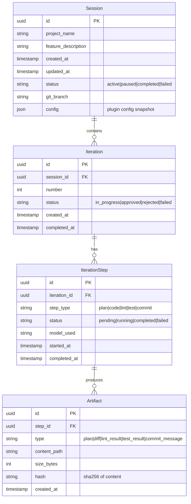

# Database Schema: AUTOPILOT Plugin

## Entity Relationship

## Storage Format
- Single JSON file per session: `.autopilot/sessions/{session-id}.json.zlib`
- Artifacts stored as separate files in `.autopilot/artifacts/{session-id}/`
- Maximum session file size: 10MB compressed

## Indexes
- Session status + updated_at (for "resume recent" queries)
- Iteration number per session (for ordering)
