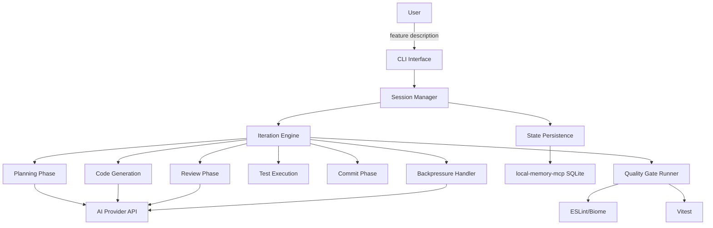

# System Architecture: AUTOPILOT Plugin

## High-Level Architecture

## Key Design Decisions
1. **Plugin architecture**: Everything runs inside opencode process via `Plugin` function hook; no external server needed
2. **Plugin registration**: Plugin is auto-detected from `.opencode/plugin/autopilot.ts` or explicitly registered via `opencode.json` → `"plugin": ["opencode-autopilot", { ... }]`
3. **FSM-based iteration**: Deterministic state machine prevents invalid state transitions
4. **Pluggable quality gates**: Child process execution for linter/test integration (not MCP-based)
5. **MCP-based state persistence**: Uses `@vheins/local-memory-mcp` (SQLite-backed MCP server) instead of raw filesystem JSON; sessions stored as MCP tasks, durable knowledge as memories
6. **Auto-spawned MCP subprocess**: AUTOPILOT spawns `@vheins/local-memory-mcp` as a subprocess via `npx` during the `config` hook — no manual MCP registration required
