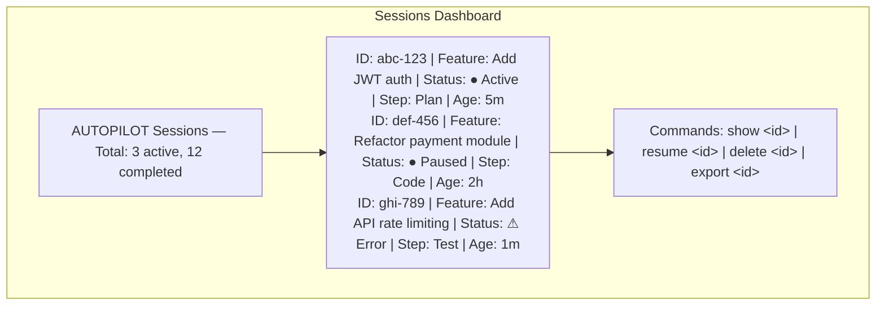
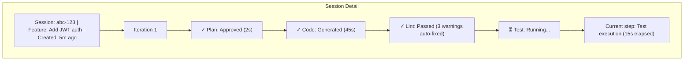

# Dashboard Layout Specification: AUTOPILOT Plugin

## Sessions Dashboard (CLI)

```mermaid
graph TB
    subgraph "Sessions Dashboard"
        Title["AUTOPILOT Sessions — Total: 3 active, 12 completed"]
        Table["ID: abc-123 | Feature: Add JWT auth | Status: ● Active | Step: Plan | Age: 5m
ID: def-456 | Feature: Refactor payment module | Status: ● Paused | Step: Code | Age: 2h
ID: ghi-789 | Feature: Add API rate limiting | Status: ⚠ Error | Step: Test | Age: 1m"]
        Footer["Commands: show &lt;id&gt; | resume &lt;id&gt; | delete &lt;id&gt; | export &lt;id&gt;"]
    end
    Title --> Table
    Table --> Footer
```

## Session Details View

```mermaid
graph TB
    subgraph "Session Detail"
        Header["Session: abc-123 | Feature: Add JWT auth | Created: 5m ago"]
        Iteration["Iteration 1"]
        Step1["✓ Plan: Approved (2s)"]
        Step2["✓ Code: Generated (45s)"]
        Step3["✓ Lint: Passed (3 warnings auto-fixed)"]
        Step4["⏳ Test: Running..."]
        Current["Current step: Test execution (15s elapsed)"]
    end
    Header --> Iteration
    Iteration --> Step1
    Step1 --> Step2
    Step2 --> Step3
    Step3 --> Step4
    Step4 --> Current
```
