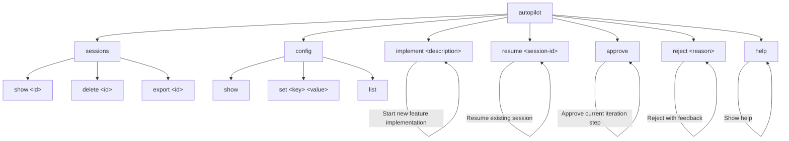

# Navigation Structure & Routes: AUTOPILOT Plugin

## CLI Command Hierarchy

## Session States (for display)

| State | Display | User Action |
|---|---|---|
| Idle | "Ready. Describe a feature to implement." | `autopilot implement` |
| Planning | "Planning implementation..." | Wait |
| AwaitingApproval | "Plan ready. Approve or reject?" | `approve` / `reject <reason>` |
| Coding | "Writing code..." | Wait |
| Reviewing | "Reviewing generated code..." | Wait |
| AwaitApproval | "Code ready. Review diff above. Approve commit?" | `approve` / `reject <reason>` |
| Error | "Error: <message>. Fix and retry?" | Fix issue, then `approve` |
| Paused | "Session paused. Resume with 'autopilot resume'" | `resume` |
