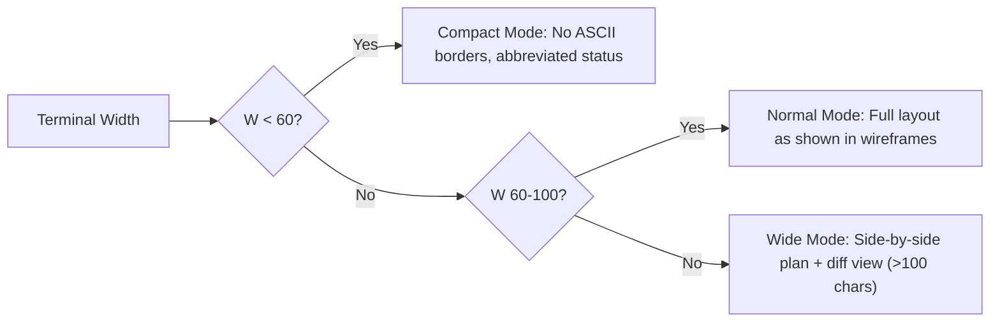

# Responsive Layout Rules: AUTOPILOT Plugin

## CLI Responsive Behavior

- Color scheme: Respect terminal theme (light/dark via OSC 4/10/11 detection)
- No mouse interaction — keyboard-only navigation (tab, arrows for multi-select, letter shortcuts)
