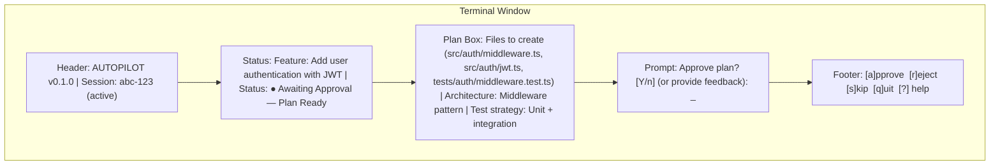
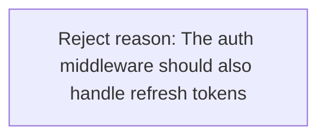

# Screen Wireframes: AUTOPILOT Plugin

## Terminal UI Layout (CLI)

```mermaid
graph TB
    subgraph "Terminal Window"
        Header["Header: AUTOPILOT v0.1.0 | Session: abc-123 (active)"]
        Status["Status: Feature: Add user authentication with JWT | Status: ● Awaiting Approval — Plan Ready"]
        PlanBox["Plan Box: Files to create (src/auth/middleware.ts, src/auth/jwt.ts, tests/auth/middleware.test.ts) | Architecture: Middleware pattern | Test strategy: Unit + integration"]
        Prompt["Prompt: Approve plan? [Y/n] (or provide feedback): _"]
        Footer["Footer: [a]pprove  [r]eject  [s]kip  [q]uit  [?] help"]
    end
    
    Header --> Status
    Status --> PlanBox
    PlanBox --> Prompt
    Prompt --> Footer
```

## Feedback Prompt

```mermaid
graph LR
    Reject["Reject reason: The auth middleware should also handle refresh tokens"]
```
