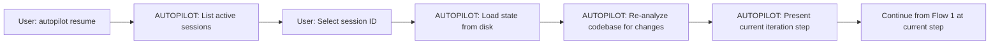
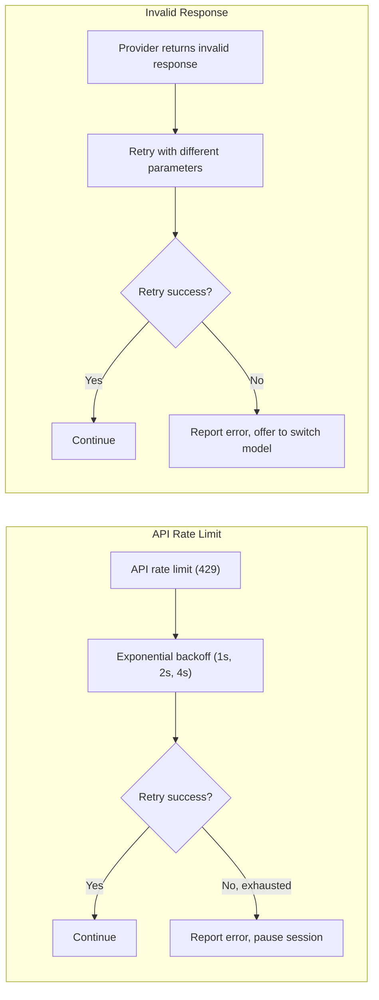

# User Flow Diagrams: AUTOPILOT Plugin

## Flow 1: New Feature Implementation

```mermaid
flowchart LR
    A["User: autopilot implement 'add JWT auth'"] --> B["AUTOPILOT: Analyze codebase context"]
    B --> C["AUTOPILOT: Generate plan (files, architecture, tests)"]
    C --> D["AUTOPILOT: Present plan to user"]
    D --> E["User: Review plan"]
    E --> F{"User: Approve?"}
    F -->|Yes| G["AUTOPILOT: Write code files"]
    F -->|No / Reject with feedback| B
    G --> H["AUTOPILOT: Run linter"]
    H --> I{"Lint pass?"}
    I -->|Pass| J["AUTOPILOT: Run tests"]
    I -->|Fail| K["Auto-fix & retry, or report"]
    K --> H
    J --> L{"Tests pass?"}
    L -->|Pass| M["AUTOPILOT: Present diff + lint/test results"]
    L -->|Fail| G
    M --> N["User: Review results"]
    N --> O{"User: Approve commit?"}
    O -->|Yes| P["AUTOPILOT: Create git commit"]
    O -->|No / Reject with feedback| G
```

## Flow 2: Resume Session

```mermaid
flowchart LR
    A["User: autopilot resume"] --> B["AUTOPILOT: List active sessions"]
    B --> C["User: Select session ID"]
    C --> D["AUTOPILOT: Load state from disk"]
    D --> E["AUTOPILOT: Re-analyze codebase for changes"]
    E --> F["AUTOPILOT: Present current iteration step"]
    F --> G["Continue from Flow 1 at current step"]
```

## Flow 3: Error Recovery

```mermaid
flowchart LR
    subgraph "API Rate Limit"
        A1["API rate limit (429)"] --> B1["Exponential backoff (1s, 2s, 4s)"]
        B1 --> C1{"Retry success?"}
        C1 -->|Yes| D1["Continue"]
        C1 -->|No, exhausted| E1["Report error, pause session"]
    end
    subgraph "Invalid Response"
        A2["Provider returns invalid response"] --> B2["Retry with different parameters"]
        B2 --> C2{"Retry success?"}
        C2 -->|Yes| D2["Continue"]
        C2 -->|No| E2["Report error, offer to switch model"]
    end
```
