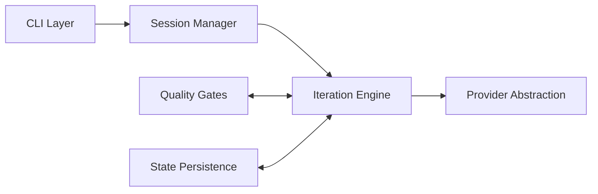

# Functional Specification Document: AUTOPILOT Plugin

## Functional Architecture

## Key Functional Flows

### Feature Implementation
1. User runs `autopilot implement "<description>"`
2. Session Manager creates new Session (status: active)
3. Iteration Engine starts Planning phase
4. AI Provider generates implementation plan
5. Plan presented to user for approval
6. On approval: Code Generation → Lint → Test → Commit Approval → Git Commit

### Session Resume
1. User runs `autopilot resume <session-id>`
2. State Persistence loads session from disk
3. Codebase re-analyzed for changes since snapshot
4. Iteration Engine restores FSM state
5. Presentation of current step to user

## Error Handling
- API errors: Retry (3x) with exponential backoff
- Lint failures: Auto-fix if possible, else report
- Test failures: Auto-regenerate code, retry once
- State corruption: SHA256 verification, auto-recovery from backup
